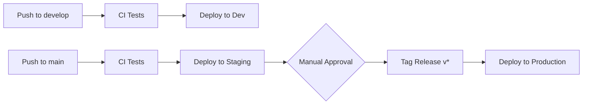

# GitHub Actions CI/CD Workflows

This directory contains GitHub Actions workflows for continuous integration and deployment of the Agentic Services Platform.

## 📋 Available Workflows

### 1. CI - Test All Agents (`ci.yml`)
**Triggers:** Push to `main`/`develop`, Pull Requests, Manual dispatch

**Purpose:** Comprehensive testing of all 24 AI agents

**Jobs:**
- **lint**: Code quality checks (Black, isort, Ruff, mypy)
- **test-agents**: Parallel testing across 4 agent groups
  - Discovery Phase (8 agents)
  - Assessment Phase (5 agents)
  - Execution Phase (6 agents)
  - Optimization Phase (5 agents)
- **test-full**: Full test suite with coverage reports
- **test-integration**: Integration tests (on push only)
- **security**: Security scanning (Safety, pip-audit, Bandit)
- **test-summary**: Summary of all test results

**Artifacts:**
- Coverage reports (HTML + XML)
- JUnit test results
- Security scan reports

**Coverage:** Automatically uploads to Codecov and comments on PRs

---

### 2. CD - Deploy to AWS (`cd.yml`)
**Triggers:** Push to `main`, Version tags (`v*`), Manual dispatch

**Purpose:** Automated deployment to AWS environments

**Jobs:**
- **build-lambda**: Build Lambda function packages
- **build-docker**: Build and cache Docker images
- **deploy-dev**: Deploy to development environment
- **deploy-staging**: Deploy to staging environment (requires dev success)
- **deploy-prod**: Deploy to production (requires staging success, tags only)
- **notify**: Send deployment status notifications

**Environments:**
- **Development** (`dev`): Auto-deploy on `develop` branch
- **Staging** (`staging`): Auto-deploy on `main` branch
- **Production** (`prod`): Manual approval required, tags only

**Required Secrets:**
- `AWS_ACCESS_KEY_ID` - AWS access key for dev/staging
- `AWS_SECRET_ACCESS_KEY` - AWS secret key for dev/staging
- `AWS_PROD_ACCESS_KEY_ID` - Separate credentials for production
- `AWS_PROD_SECRET_ACCESS_KEY` - Separate credentials for production

**Post-Deployment:**
- Runs smoke tests (`/health`, `/agents`)
- Creates GitHub releases for tagged versions
- Outputs API Gateway endpoint URL

---

### 3. Scheduled - Nightly Tests (`scheduled.yml`)
**Triggers:** Daily at 2 AM UTC, Manual dispatch

**Purpose:** Comprehensive nightly testing and quality checks

**Jobs:**
- **nightly-tests**: Full test suite with verbose output
  - Enforces 80% coverage threshold
  - Generates detailed coverage reports
- **security-scan**: Comprehensive security scanning
  - Safety (known vulnerabilities)
  - pip-audit (dependency vulnerabilities)
  - Bandit (security linting)
  - Semgrep (static analysis)
- **dependency-check**: Check for outdated packages
- **performance-tests**: Performance and load testing (if available)
- **code-quality**: Code quality metrics
  - Cyclomatic complexity (Radon)
  - Maintainability index
  - Pylint analysis
- **notify-results**: Summary of all nightly jobs

**Artifacts (14-30 day retention):**
- Complete test results
- Security scan reports
- Dependency update reports
- Code quality metrics
- Performance benchmarks

---

## 🚀 Quick Start

### Running Workflows Locally

Before pushing, test locally:

```bash
# Run tests
pytest tests/ -v --cov=src/agentic_services

# Run linting
black --check src/ tests/
isort --check-only src/ tests/
ruff check src/ tests/
mypy src/ --ignore-missing-imports

# Build Lambda packages (if deploying)
cd infrastructure/lambda
./build.sh
```

### Manual Workflow Dispatch

All workflows support manual triggering:

1. Go to **Actions** tab in GitHub
2. Select the workflow (CI, CD, or Scheduled)
3. Click **Run workflow**
4. Select branch and options
5. Click **Run workflow** button

---

## 🎯 Workflow Matrix Strategy

### Agent Test Groups

Tests run in parallel across 4 groups for faster execution:

| Group | Agents | Test Files |
|-------|--------|-----------|
| **Discovery** | 8 agents | DiscoveryAgent, AnalysisAgent, PlanningAgent, ArtifactGenerationAgent, NetworkScannerAgent, ApplicationProfilerAgent, PerformanceMonitorAgent, DataClassifierAgent |
| **Assessment** | 5 agents | DependencyMapperAgent, ComplianceCheckerAgent, CostEstimatorAgent, RiskAssessmentAgent, CapacityPlannerAgent |
| **Execution** | 6 agents | InfrastructureProvisionerAgent, DataMigrationAgent, ApplicationMigrationAgent, ConfigurationAgent, TestingAgent, RollbackAgent |
| **Optimization** | 5 agents | PerformanceOptimizerAgent, CostOptimizerAgent, SecurityHardeningAgent, MonitoringSetupAgent, DocumentationAgent |

**Total: 24 agents tested in parallel**

---

## 📊 Coverage Requirements

- **Minimum Coverage:** 80% (enforced in nightly builds)
- **Target Coverage:** 85%+ per agent
- **Current Coverage:** Tracked in Codecov

### Coverage Reporting

- **HTML Reports:** Uploaded as artifacts (downloadable)
- **Codecov Integration:** Automatic upload on all test runs
- **PR Comments:** Coverage changes commented on pull requests

---

## 🔐 Security Scanning

### Tools Used

1. **Safety**: Checks dependencies against vulnerability database
2. **pip-audit**: Official PyPA tool for auditing Python packages
3. **Bandit**: Security linting for Python code
4. **Semgrep**: Static analysis with security rules

### When Security Scans Run

- On every PR/push (basic checks)
- Nightly (comprehensive scans)
- Can be triggered manually

---

## 🌍 Deployment Workflow

### Development → Staging → Production



### Environment Configuration

Each environment has separate:
- AWS credentials
- Terraform workspaces
- S3 buckets
- DynamoDB tables
- API Gateway endpoints

### Rollback Strategy

If deployment fails:
1. Terraform automatically rolls back
2. Previous Lambda versions remain available
3. Can manually revert to previous deployment
4. Use GitHub Actions to re-run previous successful workflow

---

## 📝 Pull Request Workflow

1. Create PR from feature branch
2. **Automatic CI Checks:**
   - Code linting
   - All agent tests (4 groups in parallel)
   - Full test suite
   - Security scan
3. **PR Review:**
   - Coverage report commented
   - Test results visible
   - All checks must pass
4. **Merge:**
   - Squash and merge recommended
   - Triggers deployment pipeline

---

## 🔧 Troubleshooting

### Common Issues

**❌ Tests failing locally but passing in CI:**
- Check Python version (3.11 required)
- Ensure all dev dependencies installed: `pip install -e ".[dev]"`
- Clear pytest cache: `pytest --cache-clear`

**❌ Deployment failing:**
- Verify AWS credentials in GitHub Secrets
- Check Terraform state hasn't been corrupted
- Review CloudWatch logs for Lambda errors
- Ensure Lambda packages built correctly

**❌ Coverage not uploading:**
- Check Codecov token in GitHub Secrets (if using private repo)
- Verify `coverage.xml` file generated
- Review Codecov action logs

**❌ Scheduled workflow not running:**
- Check repository settings → Actions → Allow workflows
- Verify cron schedule syntax
- GitHub may delay scheduled workflows by up to 15 minutes

---

## 📈 Monitoring Workflow Health

### GitHub Actions Dashboard

View workflow runs:
- **Actions** tab → See all workflow runs
- Click workflow run → View job details
- Download artifacts → Get test reports

### Badges

Add to README.md:

```markdown
[](https://github.com/USERNAME/agentic-services/actions)
[](https://codecov.io/gh/USERNAME/agentic-services)
```

---

## 🎯 Best Practices

### Before Pushing

1. ✅ Run tests locally
2. ✅ Check code formatting
3. ✅ Update tests for new features
4. ✅ Update documentation
5. ✅ Review PR template checklist

### For New Agents

When adding a new agent:

1. Create agent file: `src/agentic_services/agents/new_agent.py`
2. Create test file: `tests/agents/test_new_agent.py`
3. Add to appropriate group in `ci.yml` matrix
4. Update PR template with new agent name
5. Update this README if needed

### For Infrastructure Changes

1. Update Terraform files
2. Run `terraform validate` locally
3. Update `cd.yml` if new resources added
4. Test deployment to dev environment
5. Document any manual steps needed

---

## 📚 Additional Resources

- [GitHub Actions Documentation](https://docs.github.com/en/actions)
- [Terraform GitHub Actions](https://github.com/hashicorp/setup-terraform)
- [AWS CLI Documentation](https://docs.aws.amazon.com/cli/)
- [Project WARP.md](../../WARP.md) - Development guide
- [Project README](../../README.md) - Main documentation

---

## 🤝 Contributing

When modifying workflows:

1. Test changes in a fork first
2. Document any new jobs or steps
3. Update this README
4. Verify all required secrets documented
5. Test manual workflow dispatch

---

**Last Updated:** 2025-01-13  
**Maintainer:** Agentic Services Team
